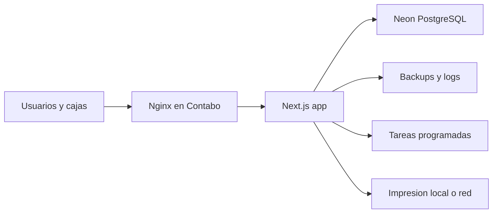

# Table Pong Blueprint

## Objetivo

Este documento traduce los seis to-dos asignados del plan de adaptacion a decisiones de diseno ejecutables sobre la base actual del ERP. La idea es preservar compatibilidad con el flujo existente mientras se incorpora un modelo operativo real de sport bar, una capa comercial separada para la relacion Shanklish -> TP, una arquitectura de despliegue adecuada y la base del modulo de juegos para segunda iteracion.

## 1. Modelo POS Sport Bar

### Extension de esquema ya modelada

Se extendio `prisma/schema.prisma` con estas piezas nuevas:

- `Branch`: sucursal operativa.
- `ServiceZone`: zona de servicio dentro de la sucursal.
- `TableOrStation`: mesa, puesto de barra, cuarto VIP o estacion de juego.
- `OpenTab`: cuenta abierta viva antes del cobro final.
- `OpenTabOrder`: puente entre una cuenta abierta y las ordenes parciales que se van agregando.
- `PaymentSplit`: division de cuenta por personas, items o montos personalizados.

Tambien se ampliaron entidades existentes para no romper el flujo actual:

- `Area` ahora puede colgar opcionalmente de `Branch`.
- `SalesOrder` ahora puede guardar `branchId`, `serviceZoneId`, `tableOrStationId`, `openTabId`, `serviceFlow`, `sourceChannel`, `kitchenStatus`, `sentToKitchenAt` y `closedAt`.
- `MenuItem`, `Recipe`, `InventoryItem`, `Requisition`, `Supplier` y `PurchaseOrder` recibieron campos compatibles con las fases de bebidas, intercompany y juegos.

### Flujo operativo propuesto

1. Apertura de cuenta:
   Se crea `OpenTab` con sucursal, zona, mesa o estacion, mesonero asignado, cantidad de invitados y etiqueta visible.
2. Consumo incremental:
   Cada adicion al consumo genera una `SalesOrder` parcial con `serviceFlow = OPEN_TAB`, sin marcarla como pagada automaticamente.
3. Envio selectivo a preparacion:
   Solo los items con `kitchenRouting = KITCHEN` o `BAR` cambian `kitchenStatus` y generan comandera.
4. Pre-cierre:
   `OpenTab` mantiene acumulados corrientes (`runningSubtotal`, `runningTotal`, `balanceDue`) para mostrar deuda viva.
5. Division de cuenta:
   Cada reparto genera uno o varios `PaymentSplit`.
6. Cierre:
   Cuando el saldo llega a cero, `OpenTab` pasa a `CLOSED` y las ordenes asociadas quedan cerradas.

### Concurrencia y consistencia

`OpenTab` debe tratarse como un agregado concurrente. Para evitar condiciones de carrera cuando dos usuarios cargan consumos o pagos sobre la misma cuenta, el modelo incorpora `version` y `updatedAt`, y las operaciones criticas deben actualizar la cuenta con bloqueo optimista dentro de `prisma.$transaction`.

Regla operativa:

- si la `version` cambió entre lectura y escritura, la accion debe abortar y obligar a recargar la cuenta antes de reintentar.

### Estados recomendados

- `OpenTab.status`: `OPEN`, `PARTIALLY_PAID`, `CLOSED`, `CANCELLED`
- `SalesOrder.serviceFlow`: `DIRECT_SALE`, `OPEN_TAB`, `TAB_CLOSING`
- `SalesOrder.kitchenStatus`: `NOT_SENT`, `SENT`, `IN_PROGRESS`, `READY`, `NOT_REQUIRED`
- `TableOrStation.currentStatus`: `AVAILABLE`, `OCCUPIED`, `RESERVED`, `OUT_OF_SERVICE`

## 2. Refactor del POS Actual

### Problema actual

El POS de `src/app/dashboard/pos/restaurante/page.tsx` usa un solo input libre de `Cliente / Mesa` y `createSalesOrderAction()` en `src/app/actions/pos.actions.ts` crea la orden como `CONFIRMED` y `PAID` de una vez. Eso sirve para venta mostrador, pero no para cuenta abierta ni consumo incremental.

### Refactor por capas

#### Acciones de servidor

Dividir `src/app/actions/pos.actions.ts` en operaciones explicitas:

- `openTabAction(data)`: abre una cuenta.
- `getActiveTabsAction(filters)`: lista cuentas abiertas por zona, mesero o mesa.
- `addItemsToTabAction(data)`: agrega una orden parcial a una cuenta.
- `sendTabItemsToKitchenAction(data)`: marca lineas preparables y dispara impresion.
- `prepareTabClosureAction(tabId)`: calcula deuda, descuentos y saldo.
- `registerTabPaymentAction(data)`: registra un pago unico o un `PaymentSplit`.
- `closeTabAction(tabId)`: cierra definitivamente la cuenta.

#### Servicios de dominio

Mover la logica transaccional a servicios dedicados en `src/server/services/`:

- `tab.service.ts`: apertura, acumulados, cierre y division.
- `kitchen-routing.service.ts`: decide si una linea va a cocina, barra o no requiere comandera.
- `pricing.service.ts`: subtotales, descuentos, tasas, cortesia y division.

#### UI del POS sport bar

Crear una vista derivada del POS actual con esta composicion:

- Columna izquierda: zonas y mesas o estaciones.
- Centro: menu y carrito de la cuenta activa.
- Derecha: cuentas abiertas, saldo, pagos parciales y atajos de impresion.

### Reglas clave

- Eliminar delivery de esta vista especifica.
- No cerrar ni pagar automaticamente al agregar consumo.
- Permitir multiples `SalesOrder` sobre la misma `OpenTab`.
- Mantener impresion inmediata solo para items preparables.
- Mantener el POS viejo operativo mientras se monta el nuevo, usando una ruta nueva y campos opcionales del schema.

## 3. Estrategia de Bebidas, Recetas y Transferencias

### Clasificacion operativa

Usar `InventoryItem.isBeverage`, `beverageCategory`, `stockTrackingMode` y `requiresRecipeForSale` para clasificar:

- Bebida empaquetada:
  `stockTrackingMode = UNIT`
- Coctel:
  `stockTrackingMode = RECIPE`
- Combo o bucket:
  `stockTrackingMode = COMPOUND`
- Item solo visual o de servicio:
  `stockTrackingMode = DISPLAY_ONLY`

### Reglas de descuento de stock

- Toda bebida vendible debe tener o bien `recipeId`, o una estrategia `UNIT` explicitamente definida.
- `MenuItem.serviceCategory` debe distinguir `PACKAGED_DRINK`, `COCKTAIL`, `BUCKET` y `FOOD`.
- `MenuItem.kitchenRouting` debe enviar a barra solo lo que requiere preparacion.
- `Recipe.recipeType` debe separar `STANDARD`, `COCKTAIL`, `BUCKET` y `PREBATCH`.
- Antes de aceptar `COCKTAIL` o `BUCKET` en una cuenta, el backend debe validar la disponibilidad de todos los componentes de la receta en el area de venta.

### Estrategia de catalogo

- Botella cerrada: item vendible por unidad, sin receta.
- Refresco o jugo individual: item vendible por unidad.
- Coctel: `MenuItem` con `recipeId` obligatorio.
- Bucket o promo: receta compuesta con multiples unidades de salida.
- Garnish, mixers y bases: inventario de insumo, nunca item de venta directa sin regla.

### Transferencias entre almacen y barras

Unificar la semantica de `src/app/actions/requisition.actions.ts` alrededor de:

- `Requisition.transferType = INTERNAL`, `BAR_REPLENISHMENT`, `RETURN` o `BULK`
- `InventoryMovement.movementType = TRANSFER_OUT` para origen
- `InventoryMovement.movementType = TRANSFER_IN` para destino

### Politica operativa sugerida

1. Reabastecimiento diario:
   del almacen principal hacia `Barra principal` o `Barra auxiliar`.
2. Consumo:
   el POS descuenta desde el area donde realmente se vende.
3. Cierre:
   `DailyInventory` compara conteo final contra ventas, mermas y transferencias.
4. Excepciones:
   rotura, cortesia y merma deben generar movimientos explicitos y no mezclarse con ventas.

## 4. Modelo Comercial Shanklish -> TP

### Principio contable

Shanklish actua como proveedor interno de cocina y TP cobra al cliente final. Por eso la venta al cliente no liquida automaticamente la deuda con Shanklish; primero hay que consolidar la porcion revendida y luego emitir una liquidacion semanal.

### Modelo propuesto

- `Supplier.supplierType = INTERCOMPANY`
- `Supplier.intercompanyCode = SHANKLISH`
- `PurchaseOrder.procurementType = INTERCOMPANY` para abastecimiento formal si se quiere registrar orden de compra interna.
- `IntercompanySettlement` para consolidar deuda semanal o por periodo.

### Flujo comercial

1. Catalogo:
   marcar a Shanklish como proveedor interno.
2. Abastecimiento:
   los productos de cocina revendidos por TP se vinculan a ese proveedor interno.
3. Venta:
   cuando TP vende un item de cocina, el ERP debe poder identificar que la linea proviene de Shanklish.
4. Consolidacion semanal:
   se generan `IntercompanySettlement` por rango de fechas.
5. Revision y pago:
   el estado pasa de `DRAFT` a `REVIEWED`, `POSTED` y luego `PAID`.

### Estructura minima del reporte semanal

- Periodo desde y hasta.
- Sucursal.
- Total bruto vendido de cocina Shanklish.
- Base imponible usada para la liquidacion.
- IVA o impuesto equivalente asociado al periodo.
- Descuentos y cortesia aplicados.
- Venta neta base para liquidacion.
- Monto adeudado a Shanklish.
- Cantidad de lineas o tickets incluidos.
- Observaciones y aprobacion.

### Regla fiscal recomendada

La liquidacion intercompany no debe quedar ambigua respecto al impuesto. El modelo debe guardar:

- `taxableBase`: base imponible de la operacion consolidada.
- `taxAmount`: impuesto asociado a la venta final.
- `taxIncludedSales`: monto bruto vendido incluyendo impuesto.
- `settlementBase`: criterio de calculo del `amountDue`.
- `taxTreatment`: politica sobre quien retiene o reconoce el impuesto.

Regla inicial sugerida:

- TP factura al cliente final y retiene el impuesto de salida.
- La liquidacion hacia Shanklish se calcula sobre `NET_SALES` o `TAXABLE_BASE`, nunca de manera implicita sobre el bruto sin definir.

### Fuente de datos recomendada

El reporte debe salir de `SalesOrderItem` + `MenuItem` + `Supplier` o un marcador equivalente en el item de menu. Si mas adelante se agrega costo por item o porcentaje pactado, `IntercompanySettlement.amountDue` puede calcularse desde regla fija o desde costo real.

## 5. Arquitectura Contabo + Neon

### Decision objetivo

- `Neon` como PostgreSQL gestionado.
- `Contabo VPS` para ejecutar la app Next.js, reverse proxy, logs, backups de archivos y tareas programadas.

### Topologia recomendada

### Componentes del VPS

- Docker o proceso Node administrado por PM2 o systemd.
- Nginx con TLS y proxy reverso.
- Servicio de despliegue automatizado desde repositorio.
- Rotacion de logs.
- Cron para backups de archivos, exportes y chequeos de salud.

### Responsabilidades por plataforma

- Neon:
  base de datos primaria, ramas si se requieren, backups gestionados y alta disponibilidad del motor.
- Contabo:
  aplicacion, proxy, observabilidad basica, scripts de mantenimiento y conectores de impresion.

### Pooling de conexiones

Al conectar Next.js desde un VPS hacia Neon, `DATABASE_URL` debe usar el pooler de Neon y no una conexion directa sin pooling. Esto reduce el riesgo de agotar conexiones en re-despliegues, escalado horizontal o picos de trafico.

Regla practica:

- usar la cadena de conexion pooler de Neon para la app.
- reservar una cadena directa separada solo para migraciones, tareas administrativas o `prisma migrate` si fuera necesario.

### Politica de respaldo

- Backup diario logico de base con `pg_dump` hacia almacenamiento cifrado.
- Backup de archivos y configuraciones del VPS.
- Monitoreo de espacio, memoria, certificado TLS y latencia hacia Neon.

### Variables de entorno clave

- `DATABASE_URL` apuntando a Neon con pooler.
- `DIRECT_DATABASE_URL` para migraciones si el flujo de Prisma lo requiere.
- `NEXTAUTH_URL`
- `NEXTAUTH_SECRET`
- credenciales de email, impresion y cualquier integracion externa.

## 6. Modulo de Juegos Fase 2

### Entidades ya modeladas

- `GameType`
- `GameStation`
- `GameSession`
- `QueueTicket`
- `WristbandPlan`
- `Reservation`

### Casos de uso que debe cubrir

- Brazalete con uso libre.
- Sesion por tiempo en estaciones concretas.
- Cola visual para estaciones saturadas.
- Reserva futura de mesa o estacion de juego.
- Extensiones de sesion sin cerrar la cuenta principal.

### Modo mixto propuesto

- `WristbandPlan` cubre modalidad libre o paquete temporal.
- `GameSession` registra uso real por estacion o por acceso general.
- `QueueTicket` organiza lista de espera.
- `Reservation` coordina reservas previas y check-in.
- `GameStation` puede mapearse a una `TableOrStation` para reutilizar la grilla visual del salon.

### Flujo operativo

1. Se crea reserva o walk-in.
2. Si hay estacion disponible, se abre `GameSession`.
3. Si no hay cupo, se crea `QueueTicket`.
4. Cuando la estacion se libera, el ticket pasa a `CALLED`.
5. La sesion puede extenderse y luego cerrarse con cargo directo o integrado a una `OpenTab`.

## Orden sugerido de ejecucion tecnica

1. Crear migracion Prisma para los modelos agregados.
2. Crear seed minimo de `Branch`, `ServiceZone` y `TableOrStation`.
3. Construir `tab.service.ts` y las acciones nuevas del POS.
4. Montar nueva UI de POS sport bar sin eliminar la actual.
5. Endurecer bebidas y transferencias con reglas de stock.
6. Implementar reporte semanal Shanklish -> TP.
7. Ajustar despliegue a Contabo + Neon.
8. Entrar a modulo de juegos cuando el POS y el inventario ya esten estables.

## Riesgos a vigilar

- Si se migra el POS viejo directamente, se rompe el flujo de venta rapida actual.
- Si las bebidas no quedan tipificadas, los descargos de stock seguiran siendo inconsistentes.
- Si la deuda intercompany se calcula desde datos incompletos, el reporte semanal no sera confiable.
- Si el VPS y Neon no quedan con observabilidad y backups, el despliegue sera fragil.
